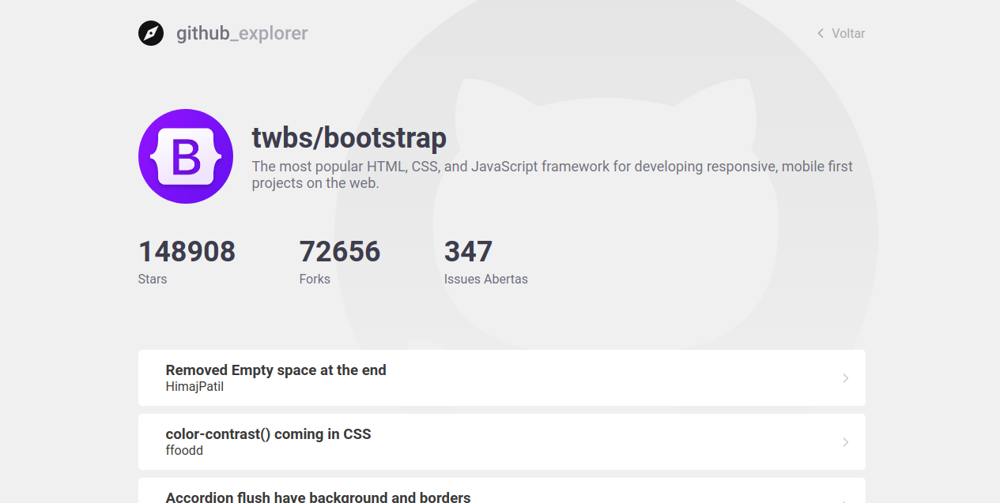

# Github Explorer

Este projeto foi criado para explorar repositórios e salva-los localmente no navegador, podendo o usuário visualizar os detalhes do repositório clicando neles.

 

# Imagens

## Home

 

## Listagem

 

## Visualização de Detalhes

 

## Script

No diretorio do projeto você pode executar

### `yarn start`

Executa o aplicativo no modo de desenvolvimento.
 
Abra http: // localhost: 3000 para visualizá-lo no navegador.

### `yarn test`

Inicia o executor de teste no modo de observação interativo.\
Veja a seção sobre [running tests](https://facebook.github.io/create-react-app/docs/running-tests) para mais informações.

### `yarn build`

Builds the app for production to the `build` folder.\
It correctly bundles React in production mode and optimizes the build for the best performance.

The build is minified and the filenames include the hashes.\
Your app is ready to be deployed!

See the section about [deployment](https://facebook.github.io/create-react-app/docs/deployment) for more information.

### `yarn eject`

**Nota: esta é uma operação unilateral. Depois de `ejetar`, você não pode voltar!**

Se não estiver satisfeito com a ferramenta de construção e as opções de configuração, você pode `ejetar` a qualquer momento. Este comando removerá a dependência de compilação única de seu projeto.

Em vez disso, ele copiará todos os arquivos de configuração e as dependências transitivas (webpack, Babel, ESLint, etc) diretamente em seu projeto para que você tenha total controle sobre eles. Todos os comandos, exceto `eject`, ainda funcionarão, mas eles irão apontar para os scripts copiados para que você possa ajustá-los. Neste ponto, você está sozinho.

Você nunca precisa usar `ejetar`. O conjunto de recursos selecionados é adequado para implantações pequenas e médias, e você não deve se sentir obrigado a usar esse recurso. No entanto, entendemos que esta ferramenta não seria útil se você não pudesse personalizá-la quando estiver pronto para ela.

### `Tecnologias`

As seguintes ferramentas foram usadas na construção do projeto:

<ul>
    <li>React</li>
    <li>Javascript</li>
    <li>HTML</li>
    <li>CSS</li>
</ul>

### `Autor`

<a href="">
 
  
 <b>Carlos Eduardo</b></a>

Feito com ❤️ por Carlos Eduardo

<a href="mailto:carloseduardodiasbatista@gmail.com">Entre em contato</a>

